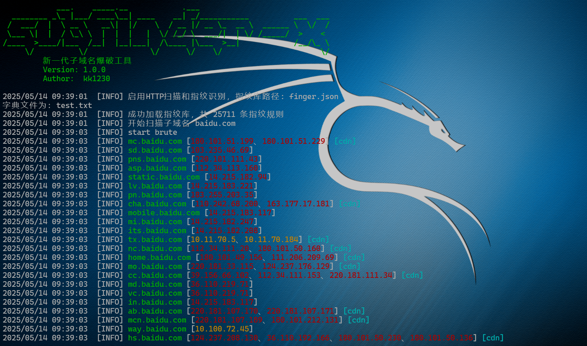

# subfinder-x - 新一代子域名爆破工具


## 工具简介
subfinder-x是一款高性能的子域名爆破工具，使用 Go 语言开发，专为信息收集和渗透测试场景设计。该工具能够快速发现目标域名的子域名，并支持多级子域名扫描、HTTP服务识别和指纹识别等功能。


## 使用方法

### 基本用法

| 参数 | 长参数 | 说明 | 默认值 |
| ---- | ------ | ---- | ------ |
| `-v` | `--version` | 显示版本信息 | - |
| `-u` | `--domain` | 指定目标域名 | - |
| `-f` | `--file` | 用于指定包含多个目标域名的文件 | - |
| `-d` | `--dict` | 指定字典文件 | test.txt |
| `-fd` | `--fuzz_data` | 设置FUZZ数据 | - |
| `-x` | - | 启用HTTP扫描和指纹识别 | false |
| `-fp` | - | 指定指纹库路径 | finger.json |

#### 基本扫描

```bash
# 使用默认配置扫描目标域名
subfinder-x.exe -u example.com
```


#### 使用自定义字典

```bash
# 使用自定义字典文件进行扫描
subfinder-x.exe -u example.com -d subdict.txt
```

#### 使用FUZZ模式

```bash
# 使用FUZZ模式进行定向扫描
subfinder-x.exe -u example.com -fd "test-FUZZ" -d subdict.txt
```


#### 启用HTTP扫描

```bash
# 启用HTTP服务扫描和指纹识别
subfinder-x.exe -u example.com -x
```


## 高级功能

### FUZZ模式

FUZZ模式允许用户定义特定的子域名模式，工具会将字典中的每个词替换到 "FUZZ" 的位置。这对于定向扫描特定模式的子域名非常有用。

### HTTP服务扫描

启用HTTP服务扫描后，工具会对发现的子域名进行HTTP和HTTPS请求，识别Web服务，并提取标题和指纹信息。
